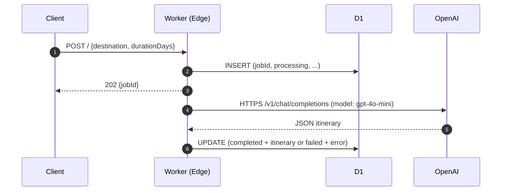
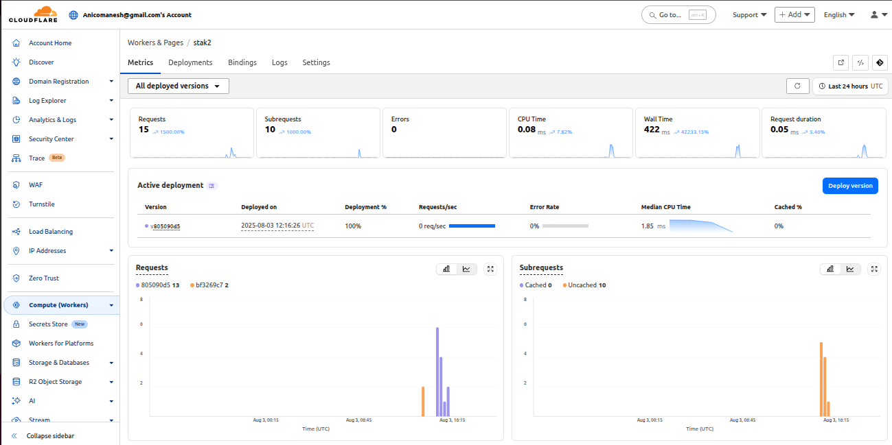

# AI-Powered Itinerary Generator  
> Cloudflare Worker + D1 SQLite + OpenAI GPT-4o-mini
> A lightweight, serverless API that creates structured travel itineraries **asynchronously** with a single HTTP call.

The AI-Powered Itinerary Generator is a serverless micro-service that turns two pieces of user input—destination and trip length—into a rich, structured travel plan in seconds.
Key experience:
- Instant feedback: caller receives a unique tracking ID (jobId) immediately.
- Silent processing: GPT-4o-mini composes day-by-day itineraries in the background.
- Stateless & durable: results are persisted in Cloudflare D1 (serverless SQLite).
- Zero infrastructure: scales from 1 to 1 000 000 calls without extra config.


## 1. Quick Start Command Sheet
 ```bash
# Clone & install
git clone https://github.com/<you>/stak-itinerary-generator.git
cd stak-itinerary-generator
npm install

# Secrets
wrangler secret put OPENAI_API_KEY

# Deploy
wrangler deploy

# Test
curl -X POST https://<worker>.workers.dev \
  -H "Content-Type: application/json" \
  -d '{"destination":"Barcelona","durationDays":4}'

   ```

A cURL example of how to call your API endpoint
```bash
curl -X POST "https://stak2.stak-d1-demo.workers.dev/" \
     -H "Content-Type: application/json" \
     -d '{"destination": "Paris, France", "durationDays": 3}'
```
output :
{"jobId":"f436b6f3-e109-4370-a0d6-8279f78f1e4f"}
```bash
npx wrangler d1 execute stak_itinerary --remote --command "SELECT * FROM itineraries WHERE jobId = 'f436b6f3-e109-4370-a0d6-8279f78f1e4f';"
```
output:
⛅️ wrangler 4.27.0
───────────────────
🌀 Executing on remote database stak_itinerary (952b5085-fc37-40b7-bbb7-ea022c625f2a):
🌀 To execute on your local development database, remove the --remote flag from your wrangler command.
🚣 Executed 1 command in 0.5443ms

│ jobId                                │ status    │ destination   │ durationDays │ createdAt     │ completedAt   │ itinerary │ error │
 f436b6f3-e109-4370-a0d6-8279f78f1e4f │ completed │ Paris, France │ 3            │ 1754253387720 │ 1754253398639 │ [{"day":1,"theme":"Cultural Exploration","activities":[{"time":"Morning","description":"Visit the iconic Eiffel Tower and take in panoramic views of Paris.","location":"Eiffel Tower, Champ de Mars, 5 Avenue Anatole France, 75007 Paris"},{"time":"Afternoon","description":"Explore the Louvre Museum and see the Mona Lisa.","location":"Louvre Museum, Rue de Rivoli, 75001 Paris"},{"time":"Evening","description":"Dinner at a traditional French bistro in the Montmartre district.","location":"Le Consulat, 18 Rue Norvins, 75018 Paris"}]},{"day":2,"theme":"Historical Insights","activities":[{"time":"Morning","description":"Take a guided tour of Notre-Dame Cathedral.","location":"Notre-Dame Cathedral, 6 Parvis Notre-Dame - Pl. Jean-Paul II, 75004 Paris"},{"time":"Afternoon","description":"Visit the historical Palace of Versailles and its gardens.","location":"Palace of Versailles, Place d'Armes, 78000 Versailles"},{"time":"Evening","description":"Enjoy a Seine River cruise to see Paris illuminated at night.","location":"Bateaux Parisiens, Port de la Bourdonnais, 75007 Paris"}]},{"day":3,"theme":"Local Experiences","activities":[{"time":"Morning","description":"Stroll through the charming streets of Le Marais and visit trendy boutiques.","location":"Le Marais, 75003 Paris"},{"time":"Afternoon","description":"Relax at a café and enjoy authentic French pastries.","location":"Café de Flore, 172 Boulevard Saint-Germain, 75006 Paris"},{"time":"Evening","description":"Attend a show at the Moulin Rouge.","location":"Moulin Rouge, 82 Boulevard de Clichy, 75018 Paris"}]}] │ null  │


## 2. Setup Guide

Follow these exact steps to deploy and run the API from a fresh clone.


### 2.1 Prerequisites


- Node 20+ | `curl -fsSL https://fnm.vercel.app/install \| bash` |
- Wrangler CLI | `npm i -g wrangler` |


### 2.2 Clone & Install

```bash
git clone https://github.com/<you>/stak-itinerary-generator.git
cd stak-itinerary-generator
npm install
```

### 2.3 Configure Secrets

```bash
wrangler login                    # authenticate once
wrangler secret put OPENAI_API_KEY
# paste your OpenAI key when prompted
```

### 2.4 Verify D1 Database

```bash
wrangler d1 list
# ensure `stak_itinerary` appears with correct ID
```

If missing:

```bash
wrangler d1 create stak_itinerary
wrangler d1 execute stak_itinerary --file=migrations/0001_init.sql
```

### 2.5 Deploy

```bash
wrangler deploy
```

The CLI prints the live URL:

```
https://<unique-subdomain>.workers.dev
```

### 2.6 Quick Smoke Test

```bash
curl -X POST https://<unique-subdomain>.workers.dev \
  -H "Content-Type: application/json" \
  -d '{"destination":"Lisbon, Portugal","durationDays":3}'
```

Expect:

```json
{ "jobId": "a1b2c3d4-..." }
```

After ~10 s:

```bash
wrangler d1 execute stak_itinerary --command="SELECT * FROM itineraries WHERE jobId='a1b2c3d4-...'"
```

### 2.7 Local Development (optional)

```bash
wrangler dev
# visit http://localhost:8787
```

### 2.8 Continuous Deployment (optional)

Add the following to your CI:

```yaml
- name: Deploy
  run: |
    npm ci
    wrangler deploy
  env:
    CLOUDFLARE_API_TOKEN: ${{ secrets.CF_API_TOKEN }}
```

 ***You’re live!***

## 3. Architecture Deep Dive

### 3.1 High-Level Blueprint
The solution is a **three-tier, edge-native architecture** comprising:

1. **Edge Compute Layer** – Cloudflare Worker executing TypeScript on V8 isolates  
2. **State Layer** – Cloudflare D1 (serverless SQLite) for durable, relational storage  
3. **Intelligence Layer** – OpenAI GPT-4o-mini via REST for structured generation

All tiers are co-located on Cloudflare’s global edge, eliminating cold starts and egress charges.

### 3.2 Component Specification

| Component | Technology | Regionality | SLA | Observability |
|---|---|---|---|---|
| **Ingress** | Cloudflare Worker | 300+ PoPs | 99.9 % | Logs → Workers Analytics |
| **Persistence** | D1 SQLite | Same PoP | 99.9 % | Query metrics in CF Dash |
| **LLM** | OpenAI `gpt-4o-mini` | US/EU clusters | 99.9 % | Token usage via OpenAI API |

### 3.3 Data Flow Sequence



### 3.4 Storage Schema (D1)

```sql
CREATE TABLE itineraries (
  jobId         TEXT PRIMARY KEY,
  status        TEXT CHECK(status IN ('processing','completed','failed')) NOT NULL,
  destination   TEXT NOT NULL,
  durationDays  INTEGER NOT NULL,
  itinerary     TEXT,                 -- JSON
  error         TEXT,
  createdAt     INTEGER,              -- epoch ms
  completedAt   INTEGER
);
```

- **Primary key** enforces idempotency.  
- **CHECK constraint** guarantees state-machine correctness.  

### 3.5 Security & Compliance

| Control | Implementation |
|---|---|
| **Secrets** | `wrangler secret put OPENAI_API_KEY` – never in repo |
| **Rate Limiting** | Worker CPU 30 s per invocation; OpenAI token budget |
| **CORS** | Worker returns `Access-Control-Allow-Origin: *` for browser use |
| **Data Residency** | D1 shards remain in chosen region (default: US) |

### 3.6 Observability & Debugging

- **Logs**: `wrangler tail` streams live Worker logs.  
- **Metrics**: D1 query latency & row counts visible in Cloudflare Dashboard → D1 → Metrics.  
- **Alerts**: Custom Webhooks via Workers Analytics Engine (optional).

### 3.7 Extensibility Hooks

| Extension | Plug-in Path |
|---|---|
| **Frontend** | Add `GET /status/:jobId` + Cloudflare Pages Svelte app |
| **Retry Logic** | Wrap OpenAI call in exponential backoff loop |
| **Multi-Model** | Switch `model` field or add provider abstraction layer |

### 3.8 Architectural Choices

| Decision | Rationale |
|----------|-----------|
| **D1 over Firestore** | Lower latency, zero egress, single-file SQL migrations |
| **Async via `ctx.waitUntil`** | Instant 202 response while LLM runs |
| **Zod validation** | Guarantees schema even if LLM drifts |
| **Plain fetch to OpenAI** | Smaller bundle vs. `openai` SDK |


Yes—prompt design is a **first-class architectural concern** for any LLM-driven system.  
We surface it **once** inside the Architecture section, then link to a concise **Prompt Engineering Deep-Dive** subsection so readers can find it quickly without cluttering the flow.

---


### 4. Prompt Engineering 

**Design Principles**  
- **Single-purpose prompt**: one-shot JSON generation, zero conversational text.  
- **Schema enforcement**: inline JSON schema + `response_format: "json_object"` guarantees deterministic shape.  
- **Token efficiency**: minimal instructions (~120 tokens) reduce cost and latency.  

**Production Prompt Template**  
```text
Generate a detailed JSON travel itinerary for a 3-day trip to Tokyo.  
Return **only** valid JSON adhering to:  
{ "itinerary": [ { "day": 1, "theme": "...", "activities": [ { "time": "Morning|Afternoon|Evening|Night", "description": "...", "location": "..." } ] } ] }.  
No markdown, no explanations.
```

### 5. API Reference

#### `POST /`
Create a new itinerary job.

**Request**  
```json
{
  "destination": "Barcelona, Spain",
  "durationDays": 4
}
```

**Response**  
```json
{ "jobId": "a1b2c3d4-e5f6-7890-abcd-1234567890ab" }
```

#### `GET /status/:jobId`
Check status & retrieve itinerary once ready.

**Response examples**

| Status | Body |
|--------|------|
| **processing** | `{"status":"processing"}` |
| **completed** | `{"status":"completed","itinerary":[...]}` |
| **failed** | `{"status":"failed","error":"LLM timeout"}` |


### Example Workflows

#### Happy Path
```bash
# 1. Submit
JOB=$(curl -s -X POST https://stak-d1-1754217065.workers.dev \
  -H "Content-Type: application/json" \
  -d '{"destination":"Tokyo","durationDays":3}' | jq -r .jobId)

# 2. Wait ~10 s
curl https://stak-d1-1754217065.workers.dev/status/${JOB}
```

#### Debug Database
```bash
wrangler d1 execute stak_itinerary --command="SELECT * FROM itineraries ORDER BY created_at DESC LIMIT 1"
```

---

### Cloudflare Dashboard Screenshots

Workers overview: 


Metrics: 



D1 Database:


---

## License

MIT © 2025 — Your Name


