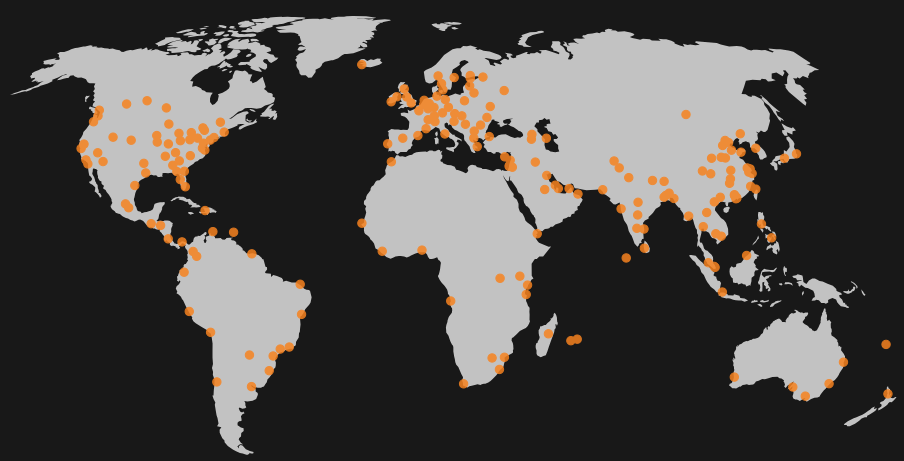
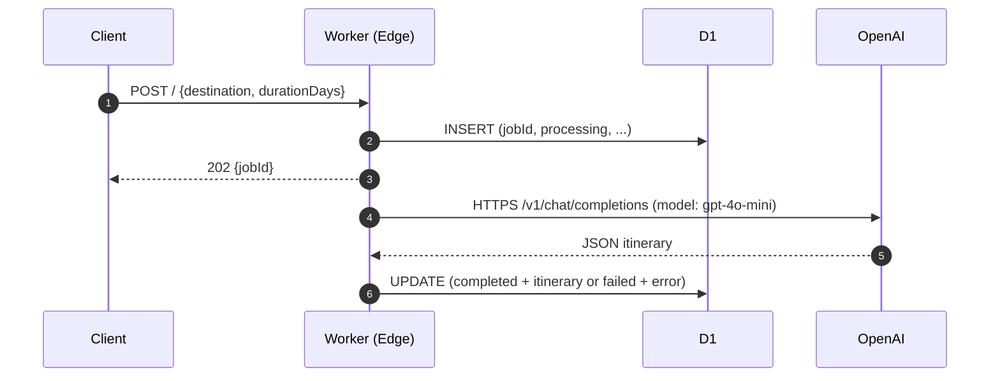
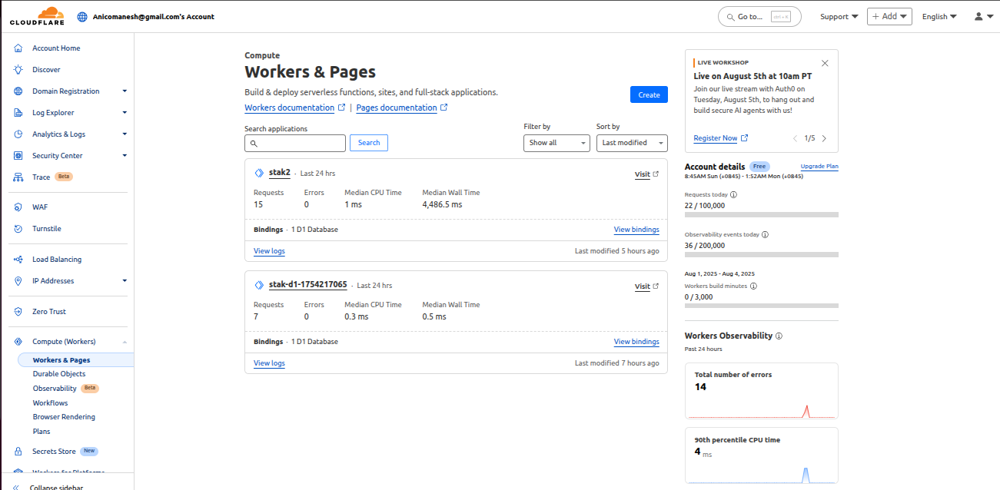
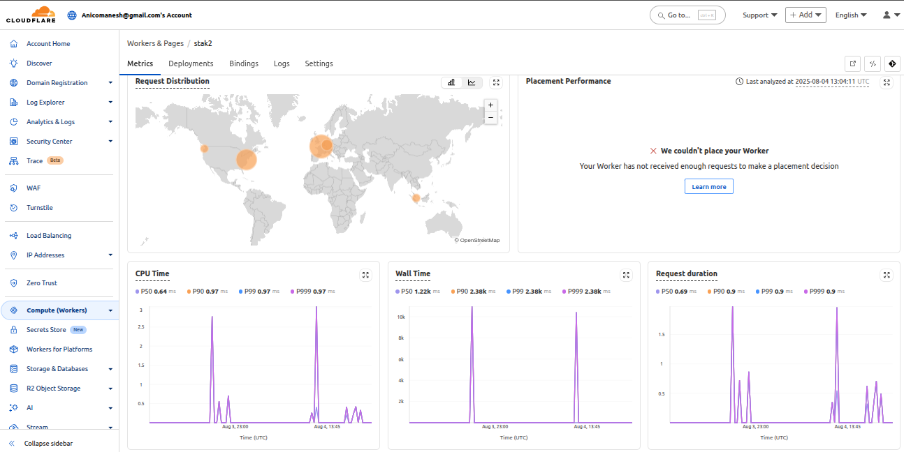
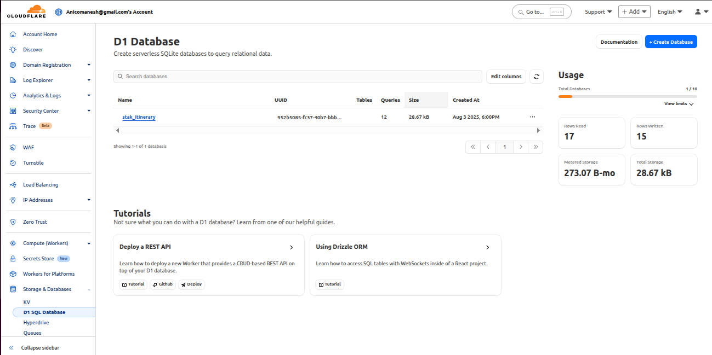

# AI-Powered Itinerary Generator  
> Cloudflare Worker + D1 SQLite + OpenAI GPT-4o-mini
> A lightweight, serverless API that creates structured travel itineraries **asynchronously** with a single HTTP call.

The AI-Powered Itinerary Generator is a serverless micro-service that turns two pieces of user input—destination and trip length—into a rich, structured travel plan in seconds.
Key experience:
- **Instant feedback**: caller receives a unique tracking ID (jobId) immediately.
- **Silent processing**: GPT-4o-mini composes day-by-day itineraries in the background.
- **Stateless & durable**: results are persisted in Cloudflare D1 (serverless SQLite).
- **Zero infrastructure**: scales from 1 to 1 000 000 calls without extra config.

  

### **Architecture of Cloudflare Workers**

- **Elasticity**: Cloudflare's platform is designed to automatically and instantly scale up the number of running Worker instances in response to traffic. It doesn't use a fixed number of servers. Instead, when a request arrives, if a worker instance is not available, Cloudflare's platform spins one up almost instantly.

- **Global Distribution**: Cloudflare's network has data centers in over 320 cities. This means that a user's request will be handled by the closest data center, not a central server farm. If traffic suddenly spikes in a specific region, Cloudflare simply spins up more worker instances in that region to handle the load.

- **Zero Configuration**: As the developer, you don't need to do anything to enable this scaling. You don't manage servers, load balancers, or virtual machines. The platform handles all of that automatically.

This is the core value proposition of a serverless platform. The "1 to 1,000,000 calls" promise is essentially the platform's guarantee.

---

### Table of Contents
- [Quick Start Command Sheet](#quick-start-command-sheet)
- [How to Test the Live API](#a-curl-example-of-how-to-call-api-endpoint)
- [Setup Instructions](#setuo-instruction)
- [Architecture](#architecture)
- [Prompt Engineering](#prompt-engineering)
- [Cloudflare Dashboard](#cloudflare-dashboard)


## Quick Start Command Sheet
 ```bash
# Clone & install
git clone https://github.com/aragit/stak-itinerary-generator.git
cd stak-itinerary-generator
npm install

# Secrets
wrangler secret put OPENAI_API_KEY

# Deploy
wrangler deploy

# Test
curl -X POST https://<worker>.workers.dev \
  -H "Content-Type: application/json" \
  -d '{"destination":"Barcelona","durationDays":4}'

   ```

**A cURL example of how to call  API endpoint:**
```bash
curl -X POST "https://stak2.stak-d1-demo.workers.dev/" \
     -H "Content-Type: application/json" \
     -d '{"destination": "Paris, France", "durationDays": 3}'
```
**Output** :
```text
{"jobId":"f436b6f3-e109-4370-a0d6-8279f78f1e4f"}
```
**Verify Results from the Database:**
```bash
npx wrangler d1 execute stak_itinerary --remote --command "SELECT * FROM itineraries WHERE jobId = 'f436b6f3-e109-4370-a0d6-8279f78f1e4f';"
```
This command runs a raw SQL query against your live D1 database from the command line it 
Retrieves the single itinerary record for the given job, showing status, JSON plan, timestamps, and any error.


**Response** :
```text
⛅️ wrangler 4.27.0
───────────────────
🌀 Executing on remote database stak_itinerary (952b5085-fc37-40b7-bbb7-ea022c625f2a):
🌀 To execute on your local development database, remove the --remote flag from your wrangler command.
🚣 Executed 1 command in 0.5443ms

│ jobId                                │ status    │ destination   │ durationDays │ createdAt     │ completedAt   │ itinerary │ error │

 f436b6f3-e109-4370-a0d6-8279f78f1e4f │ completed │ Paris, France │ 3            │ 1754253387720 │ 1754253398639 │ [{"day":1,"theme":"Cultural Exploration","activities":[{"time":"Morning","description":"Visit the iconic Eiffel Tower and take in panoramic views of Paris.","location":"Eiffel Tower, Champ de Mars, 5 Avenue Anatole France, 75007 Paris"},{"time":"Afternoon","description":"Explore the Louvre Museum and see the Mona Lisa.","location":"Louvre Museum, Rue de Rivoli, 75001 Paris"},{"time":"Evening","description":"Dinner at a traditional French bistro in the Montmartre district.","location":"Le Consulat, 18 Rue Norvins, 75018 Paris"}]},{"day":2,"theme":"Historical Insights","activities":[{"time":"Morning","description":"Take a guided tour of Notre-Dame Cathedral.","location":"Notre-Dame Cathedral, 6 Parvis Notre-Dame - Pl. Jean-Paul II, 75004 Paris"},{"time":"Afternoon","description":"Visit the historical Palace of Versailles and its gardens.","location":"Palace of Versailles, Place d'Armes, 78000 Versailles"},{"time":"Evening","description":"Enjoy a Seine River cruise to see Paris illuminated at night.","location":"Bateaux Parisiens, Port de la Bourdonnais, 75007 Paris"}]},{"day":3,"theme":"Local Experiences","activities":[{"time":"Morning","description":"Stroll through the charming streets of Le Marais and visit trendy boutiques.","location":"Le Marais, 75003 Paris"},{"time":"Afternoon","description":"Relax at a café and enjoy authentic French pastries.","location":"Café de Flore, 172 Boulevard Saint-Germain, 75006 Paris"},{"time":"Evening","description":"Attend a show at the Moulin Rouge.","location":"Moulin Rouge, 82 Boulevard de Clichy, 75018 Paris"}]}] │ null  │
```

After submitting a request, the Worker returns a rich itinerary:

```json
{
  "jobId": "f436b6f3-e109-4370-a0d6-8279f78f1e4f",
  "status": "completed",
  "destination": "Paris, France",
  "durationDays": 3,
  "createdAt": 1754253387720,
  "completedAt": 1754253398639,
  "itinerary": [
    {
      "day": 1,
      "theme": "Cultural Exploration",
      "activities": [
        {
          "time": "Morning",
          "description": "Visit the iconic Eiffel Tower and take in panoramic views of Paris.",
          "location": "Eiffel Tower, Champ de Mars, 75007 Paris"
        },
        {
          "time": "Afternoon",
          "description": "Explore the Louvre Museum and see the Mona Lisa.",
          "location": "Louvre Museum, 75001 Paris"
        },
        {
          "time": "Evening",
          "description": "Dinner at a traditional French bistro in Montmartre.",
          "location": "Le Consulat, 75018 Paris"
        }
      ]
    },
    {
      "day": 2,
      "theme": "Historical Insights",
      "activities": [
        {
          "time": "Morning",
          "description": "Guided tour of Notre-Dame Cathedral.",
          "location": "Notre-Dame Cathedral, 75004 Paris"
        },
        {
          "time": "Afternoon",
          "description": "Visit the Palace of Versailles and its gardens.",
          "location": "Palace of Versailles, 78000 Versailles"
        },
        {
          "time": "Evening",
          "description": "Seine River night cruise.",
          "location": "Bateaux Parisiens, 75007 Paris"
        }
      ]
    },
    {
      "day": 3,
      "theme": "Local Experiences",
      "activities": [
        {
          "time": "Morning",
          "description": "Stroll through Le Marais boutiques.",
          "location": "Le Marais, 75003 Paris"
        },
        {
          "time": "Afternoon",
          "description": "Café stop for French pastries.",
          "location": "Café de Flore, 75006 Paris"
        },
        {
          "time": "Evening",
          "description": "Moulin Rouge show.",
          "location": "Moulin Rouge, 75018 Paris"
        }
      ]
    }
  ],
  "error": null
}
```
--- 
## Setup Instruction

**1. Prerequisites**


- [Node.js](https://nodejs.org/en/)

- [Wrangler CLI](https://developers.cloudflare.com/workers/wrangler/install-and-update/)

**2. Clone the Repository:**  
```bash
git clone https://github.com/aragit/stak-itinerary-generator.git
cd stak-itinerary-generator
npm install
```

**3. Log In to Cloudflare**  
```bash
wrangler login
```
A browser window will open—log in once.


**4. Configure Secrets:**
For deployment, you must set your OpenAI API key as a secret. This keeps your key secure.
```bash
wrangler secret put OPENAI_API_KEY
```
Paste your OpenAI API key when prompted.


**5. Verify or Create the D1 Database:**  
```bash
wrangler d1 list
```
If `stak_itinerary` is **not listed**, create it:

```bash
wrangler d1 create stak_itinerary
```

**6. Setup Cloudflare D1:**
This command applies the database schema, creating the itineraries table on your remote D1 database.
```bash
wrangler d1 execute stak_itinerary --file=migrations/0001_init.sql
```


**7. Deploy:**  
This will compile your Worker and deploy it to your Cloudflare account. The URL for your live API will be provided in the output.
```bash
wrangler deploy
```
The CLI prints the live **Worker URL**:

```
https://<unique-subdomain>.workers.dev
```

**8. Quick Test**  
```bash
curl -X POST https://<unique-subdomain>.workers.dev \
  -H "Content-Type: application/json" \
  -d '{"destination":"Paris","durationDays":3}'
```

You’ll receive:

```json
{"jobId":"a1b2c3d4-..."}
```

After ~10 seconds, verify the record:

```bash
wrangler d1 execute stak_itinerary --remote \
  --command="SELECT * FROM itineraries WHERE jobId='a1b2c3d4-...';"
```

Done! Your API is live and ready.

---
## **Architecture**

### High-Level Blueprint
The solution is a **three-tier, edge-native architecture** comprising:

1. **Edge Compute Layer** – Cloudflare Worker executing TypeScript on V8 isolates  
2. **State Layer** – Cloudflare D1 (serverless SQLite) for durable, relational storage  
3. **Intelligence Layer** – OpenAI GPT-4o-mini via REST for structured generation

All tiers are co-located on Cloudflare’s global edge, eliminating cold starts and egress charges.

### Components Specification

| Component | Technology | Regionality | SLA | Observability |
|---|---|---|---|---|
| **Ingress** | Cloudflare Worker | 300+ PoPs | 99.9 % | Logs → Workers Analytics |
| **Persistence** | D1 SQLite | Same PoP | 99.9 % | Query metrics in CF Dash |
| **LLM** | OpenAI `gpt-4o-mini` | US/EU clusters | 99.9 % | Token usage via OpenAI API |

### Data Flow Sequence



### Storage Schema (D1)

```sql
CREATE TABLE IF NOT EXISTS itineraries (
  jobId        TEXT PRIMARY KEY,
  status       TEXT CHECK (status IN ('processing', 'completed', 'failed')) NOT NULL,
  destination  TEXT NOT NULL,
  durationDays INTEGER NOT NULL,
  itinerary    TEXT,                 
  createdAt    INTEGER,
  completedAt  INTEGER,
  error        TEXT                  
);
```


### Security & Compliance
Here is a concise security & compliance summary for the readme: secrets are stored encrypted via wrangler, requests are rate-limited at the edge, cors is enabled for browser use, and data resides in our chosen d1 region:
| Control | Implementation |
|---|---|
| **Secrets** | `wrangler secret put OPENAI_API_KEY` – never in repo |
| **Rate Limiting** | Worker CPU 30 s per invocation; OpenAI token budget |
| **CORS** | Worker returns `Access-Control-Allow-Origin: *` for browser use |
| **Data Residency** | D1 shards remain in chosen region (default: US) |

### Architectural Choices
Following table shows a concise architectural overview:
| Decision | Rationale |
|----------|-----------|
| **D1 over Firestore** | D1 offers lower latency, zero egress fees, and single-file SQL migrations—all while running serverless on Cloudflare’s edge—making it simpler and cheaper than Firestore for relational data and JSON itineraries|
| **Async via `ctx.waitUntil`** | Instant 202 response while LLM runs |
| **Zod validation** | Guarantees schema even if LLM drifts |
| **Plain fetch to OpenAI** | Smaller bundle vs. `openai` SDK |

---


## **Prompt Engineering** 

**Design Principles**  
- **Single-purpose prompt**: one-shot JSON generation, zero conversational text.  
- **Schema enforcement**: inline JSON schema + `response_format: "json_object"` guarantees deterministic shape.  
- **Token efficiency**: minimal instructions (~120 tokens) reduce cost and latency.  

**Production Prompt Template**  
```text
Generate a detailed JSON travel itinerary for a 3-day trip to Tokyo.  
Return **only** valid JSON adhering to:  
{ "itinerary": [ { "day": 1, "theme": "...", "activities": [ { "time": "Morning|Afternoon|Evening|Night", "description": "...", "location": "..." } ] } ] }.  
No markdown, no explanations.
```

--- 
## **Cloudflare Dashboard**

**Workers overview:** 



**Metrics:** 




**D1 Database:**



